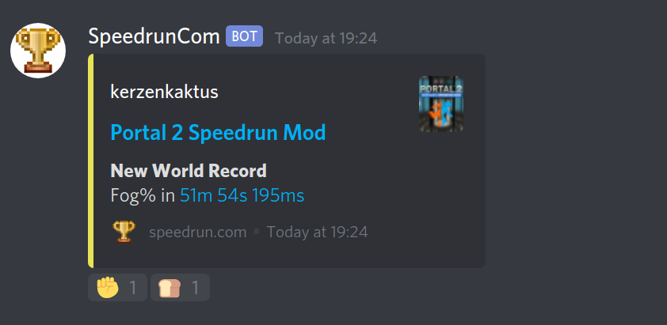
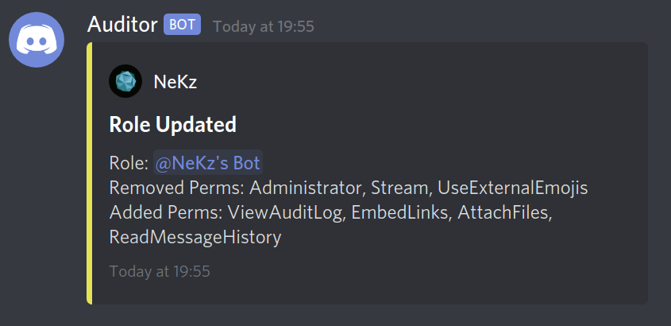
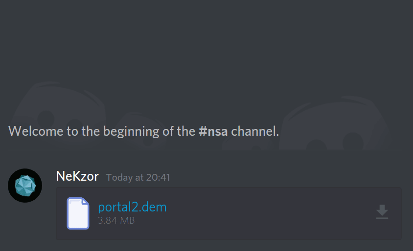
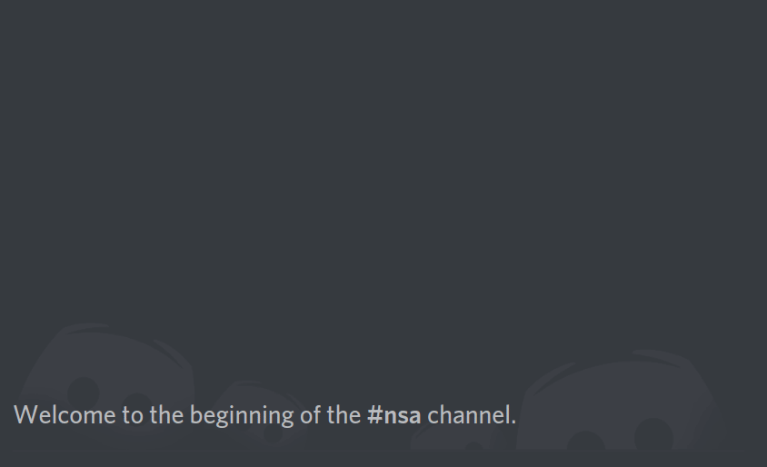
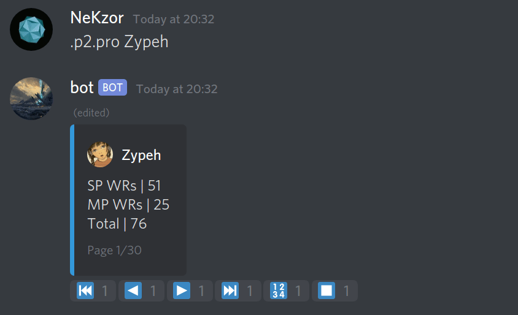

**NeKzBot** is a bot for [Discord](https://discordapp.com) which is focused on providing unique services.

## Overview

* [Services](#services)
* [Permissions](#permissions)
* [Data](#data)
* [Modules](#modules)
* [Installation](#installation)
* [Credits](#credits)
* [Libraries](#libraries)

## Services

### speedrun.com Notifications

Powered by [speedrun.com](https://speedrun.com)'s shitty API.

### Audit Log Notifications

Powered by Discord.Net and some of [my contributions](https://github.com/discord-net/Discord.Net/pull/1373).

### Source Engine Demo Parser

Powered by [SourceDemoParser.Net](https://github.com/NeKzor/SourceDemoParser.Net).

### Source Engine Cvar Dictionary

Powered by [SourceAutoRecord](https://github.com/NeKzor/SourceAutoRecord)'s dumping feature and [cvars API](https://github.com/NeKzor/cvars).

### board.iverb.me Data

Powered by [Portal2Boards.Net](https://github.com/NeKzor/Portal2Boards.Net).

## Permissions

### Required

* View Channels
* Send Messages
* Embed Links
* Attach Files
* Read Message History

### Optional

* Manage Webhooks: service subscription
* View Audit Log: only required for the auditor service

## Data

NeKzBot does not log any sensitive user data. However, this information will be saved in the bot's database:

| Data | Module | Why |
| --- | --- | --- |
| .dem files of users | [SourceModule](https://github.com/NeKzor/NeKzBot/blob/master/src/Services/SourceDemoService.cs) | Allows users to analyze their latest uploaded Source Engine recording. |
| Webhook data of channels | [ServiceModule](https://github.com/NeKzor/NeKzBot/blob/master/src/Services/Notifications/NotificationService.cs) | Allows to send notification updates. |

## Modules

| Command | Alias | Module |
| --- | --- | --- |
| `.services.` | `service` | ServiceModule |
| `.services.?` | `info`, `help` | ServiceModule |
| `.services.speedruncom.` | `srcom` | ServiceModule |
| `.services.speedruncom.subscribe` | `sub`, `create`, `hook` | ServiceModule |
| `.services.speedruncom.unsubscribe` | `unsub`, `delete`, `unhook` | ServiceModule |
| `.services.auditor.` | `audits` | ServiceModule |
| `.services.auditor.subscribe` | `sub`, `create`, `hook` | ServiceModule |
| `.services.auditor.unsubscribe` | `unsub`, `delete`, `unhook` | ServiceModule |
| `.invites` | - | AdminModule |
| `.audits (auditCount:Int32=10)` | - | AdminModule |
| `.ris <text:String...>` | - | FunModule |
| `.info` | `?` | InfoModule |
| `.stats` | - | InfoModule |
| `.invite` | - | InfoModule |
| `.modules` | `help` | InfoModule |
| `.portal2boards.` | `p2b`, `p2` | Portal2Module |
| `.portal2boards.map (mapName:String...)` | - | Portal2Module |
| `.portal2boards.discovery (discoveryName:String...)` | `exploit`, `glitch` | Portal2Module |
| `.portal2boards.?` | `info`, `help` | Portal2Module |
| `.portal2boards.leaderboard (mapName:String...)` | `lb` | Portal2Module |
| `.portal2boards.changelog <mapName:String...>` | `cl`, `clog` | Portal2Module |
| `.portal2boards.profile (userNameOrSteamId64:String...)` | `pro`, `user` | Portal2Module |
| `.portal2boards.aggregated` | `agg` | Portal2Module |
| `.cvars.` | `cvar` | SourceModule |
| `.cvars.?` | `info`, `help` | SourceModule |
| `.cvars.halflife2 <cvar:String>` | `hl2` | SourceModule |
| `.cvars.portal <cvar:String>` | `p`, `p1` | SourceModule |
| `.cvars.portal2 <cvar:String>` | `p2` | SourceModule |
| `.cvars.sourceautorecord <cvar:String>` | `sar` | SourceModule |
| `.demo.` | `dem` | SourceModule |
| `.demo.?` | `info`, `help` | SourceModule |
| `.demo.parse` | - | SourceModule |
| `.demo.get` | - | SourceModule |
| `.demo.filestamp` | `magic` | SourceModule |
| `.demo.protocol` | `protoc` | SourceModule |
| `.demo.servername` | `server` | SourceModule |
| `.demo.clientname` | `client` | SourceModule |
| `.demo.mapname` | `map` | SourceModule |
| `.demo.gamedirectory` | `dir` | SourceModule |
| `.demo.playbacktime` | `time` | SourceModule |
| `.demo.playbackticks` | `ticks` | SourceModule |
| `.demo.playbackframes` | `frames` | SourceModule |
| `.demo.signonlength` | `signon` | SourceModule |
| `.demo.messages` | `msg` | SourceModule |
| `.demo.messages <index:Int32>` | `msg` | SourceModule |
| `.demo.gettickrate` | `tickrate` | SourceModule |
| `.demo.gettickspersecond` | `tickspersecond`, `tps`, `intervalpertick`, `ipt` | SourceModule |
| `.demo.adjustexact (overwrite:Boolean=False)` | `adj` | SourceModule |
| `.demo.adjustflag (overwrite:Boolean=False)` | `adjf` | SourceModule |
| `.demo.adjust (overwrite:Boolean=False)` | `adj2` | SourceModule |
| `.guild` | `server` | StatsModule |
| `.hierarchy` | - | StatsModule |
| `.channel` | - | StatsModule |
| `.id (ascending:Boolean=True)` | - | StatsModule |
| `.disc (ascending:Boolean=True)` | `discriminator` | StatsModule |
| `.joined (ascending:Boolean=True)` | - | StatsModule |
| `.created (ascending:Boolean=True)` | - | StatsModule |
| `.score (ascending:Boolean=True)` | - | StatsModule |

## Installation

Requires dotnet SDK 3.0.103.

* `git clone --recurse-submodules https://github.com/NeKzor/NeKzBot`
* `cd NeKzBot`
* `./install`
* Configure `private/credentials.json`
  * Discord app bot token
  * speedrun.com API token
* `./build`
* `./run`

## Credits

* [Discord](https://discordapp.com/developers)
* [Discord.Net](https://github.com/discord-net/Discord.Net)

## Libraries

* [Discord.Addons.Interactive](https://github.com/foxbot/Discord.Addons.Interactive)
* [Discord.Addons.Preconditions](https://github.com/Joe4evr/Discord.Addons/tree/master/src/Discord.Addons.Preconditions)
* [LiteDB](https://github.com/mbdavid/LiteDB)
* [Newtonsoft.Json](https://github.com/JamesNK/Newtonsoft.Json)
* [Portal2Boards.Net](https://github.com/NeKzor/Portal2Boards.Net)
* [SourceDemoParser.Net](https://github.com/NeKzor/SourceDemoParser.Net)
